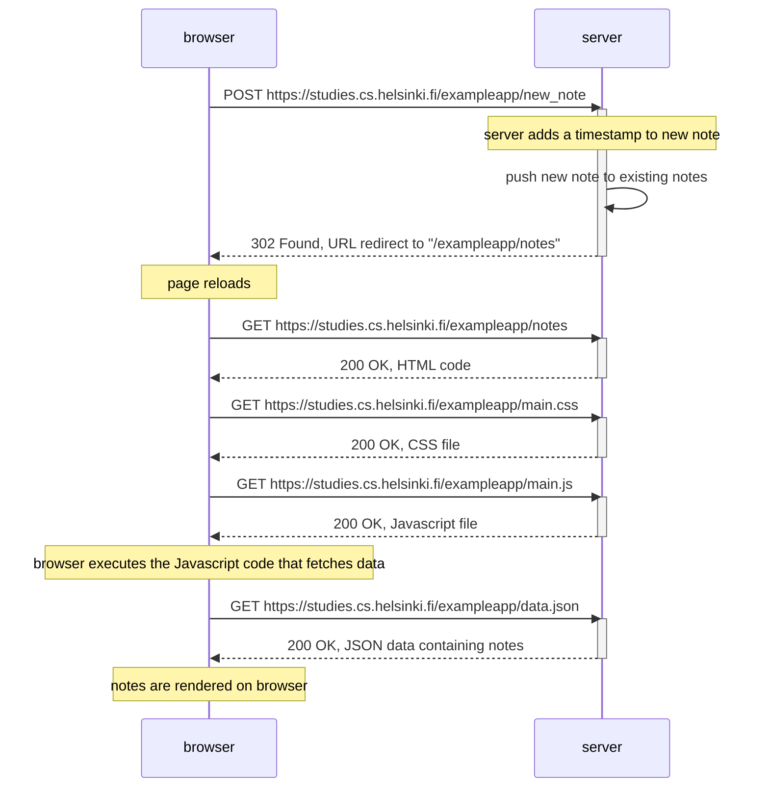

```mermaid
sequenceDiagram

    participant browser
    participant server

    browser->>server: POST https://studies.cs.helsinki.fi/exampleapp/new_note

    activate server
    Note over server: server adds a timestamp to new note
    server->>server: push new note to existing notes
    server-->>browser: 302 Found, URL redirect to "/exampleapp/notes";
    deactivate server
    Note over browser: page reloads

    browser->>server: GET https://studies.cs.helsinki.fi/exampleapp/notes;
    activate server
    server-->>browser: 200 OK, HTML code;
    deactivate server

    browser->>server: GET https://studies.cs.helsinki.fi/exampleapp/main.css;
    activate server
    server-->>browser: 200 OK, CSS file;
    deactivate server

    browser->>server: GET https://studies.cs.helsinki.fi/exampleapp/main.js;
    activate server
    server-->>browser: 200 OK, Javascript file;
    deactivate server
    Note over browser: browser executes the Javascript code that fetches data

    browser->>server: GET https://studies.cs.helsinki.fi/exampleapp/data.json;
    activate server
    server-->>browser: 200 OK, JSON data containing notes;
    deactivate server
    Note over browser: notes are rendered on browser

```
