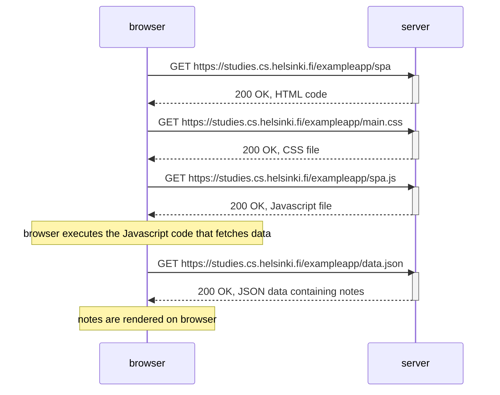

```mermaid
sequenceDiagram

    participant browser
    participant server


    browser->>server: GET https://studies.cs.helsinki.fi/exampleapp/spa
    activate server
    server-->>browser: 200 OK, HTML code;
    deactivate server

    browser->>server: GET https://studies.cs.helsinki.fi/exampleapp/main.css;
    activate server
    server-->>browser: 200 OK, CSS file;
    deactivate server

    browser->>server: GET https://studies.cs.helsinki.fi/exampleapp/spa.js;
    activate server
    server-->>browser: 200 OK, Javascript file;
    deactivate server
    Note over browser: browser executes the Javascript code that fetches data

    browser->>server: GET https://studies.cs.helsinki.fi/exampleapp/data.json;
    activate server
    server-->>browser: 200 OK, JSON data containing notes;
    deactivate server
    Note over browser: notes are rendered on browser
```
